# EDA completo — Partidos de LaLiga

## Estado del análisis

Este informe cubre el preprocesamiento T-1.4 y el EDA T-1.3 del dataset canónico provisional de LaLiga. El target aprobado es `result_ft`: **H** (victoria local), **D** (empate) y **A** (victoria visitante). El flujo es reproducible, pero **no cierra `Data Ready`**: todavía faltan las features históricas comunes y los mocks de frontend/backend.

## Resumen ejecutivo

- Se analizaron **10,804 partidos**, **54 variables** y **28 temporadas**, entre 1995-09-02 y 2023-06-04.
- La unión prioriza la fuente detallada en **100 partidos solapados** y termina con **0 IDs duplicados**, **0 targets ausentes** y **0 incoherencias**.
- El target está moderadamente desbalanceado: H=5,119 (47.4%), D=2,761 (25.6%) y A=2,924 (27.1%). La baseline mayoritaria es 47.4%.
- La media es **2.67 goles/partido**; 49.6% supera 2,5 goles y 51.5% registra goles de ambos equipos.
- Solo **0 partidos** (0.0%) contienen tiros, faltas, tarjetas y cuotas. Esta ausencia es estructural por temporada y no debe imputarse sobre el histórico.
- La baseline de cuotas de apertura no se calcula porque el conjunto de desarrollo no contiene filas con cuotas completas.

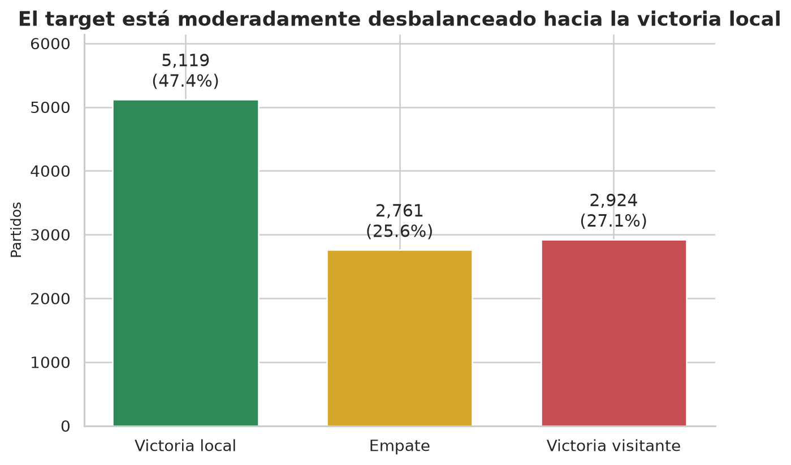

## 1. Fuentes y trazabilidad

Los CSV originales se conservan sin modificación en `data/raw/` y sus SHA-256 están en `reports/metrics/dataset_manifest.json`.

| Archivo raw | Fuente identificada | URL | Obtención | Licencia/uso |
|---|---|---|---|---|
| `LaLiga_Matches.csv` | La Liga Complete Dataset | https://www.kaggle.com/datasets/kishan305/la-liga-results-19952020 | Descarga manual del CSV consolidado publicado en Kaggle. | Data files © Original Authors (según la ficha de Kaggle). |
| `laliga_2025_2026_stats.csv` | Football-Data Spain La Liga 2025/2026 (SP1.csv) | https://www.football-data.co.uk/data.php | Descarga del CSV SP1 de la temporada 2025/2026 y renombrado local. La copia raw corresponde a una instantánea anterior a la versión actualmente publicada. | Football-Data ofrece acceso gratuito y declara los datos para predicción de partidos de liga; no publica una licencia abierta ni un permiso explícito de redistribución. |

La procedencia y las condiciones publicadas se revisaron el 23/07/2026. El uso analítico para predicción de partidos es compatible con la finalidad declarada, pero ninguna fuente concede una licencia abierta o permiso explícito de redistribución. Por política conservadora, los CSV raw y derivados fila a fila deben mantenerse locales hasta obtener permiso escrito. El CSV detallado local es una instantánea anterior a la versión actualmente servida por Football-Data: coincide en temporada, 380 filas y 131 columnas, pero no byte a byte porque las cuotas se actualizan.

## 2. Pipeline de combinación y política de columnas

- Histórico: **11,664 filas y 10 columnas**. Se conservan fecha, equipos, goles y resultados; `Season` solo valida y luego se deriva desde la fecha.
- Detallado: **380 filas y 131 columnas**. Se conservan **39** y se eliminan **92** cuotas específicas/máximas redundantes y con cobertura irregular.
- La política completa, columna por columna, está en `reports/metrics/source_column_policy.csv`.
- Clave de solapamiento: **fecha normalizada + equipo local recortado + equipo visitante recortado**.
- Estrategia: unión vertical, descartando del histórico la clave repetida y conservando la fila detallada. Se usa porque ambas fuentes describen partidos, no entidades diferentes, y la fila detallada contiene el bloque mínimo más estadísticas y promedios de mercado.

## 3. Limpieza y calidad final

Reglas deterministas:

1. Recortar texto y normalizar resultados a H/D/A.
2. Convertir fechas y goles; retirar filas con clave, marcador o target crítico inválido.
3. Eliminar duplicados exactos y duplicados de clave dentro de cada fuente.
4. Resolver los 100 solapamientos priorizando la fila detallada.
5. Conservar los dos nulos de descanso porque son opcionales, posteriores al evento y no se usarán como feature prepartido.
6. No imputar el bloque detallado ausente del histórico: el nulo es estructural.

| Control de limpieza | Histórico | Detallado |
|---|---:|---:|
| Duplicados exactos eliminados | 0 | 0 |
| Filas críticas inválidas eliminadas | 0 | 0 |
| Claves duplicadas internas eliminadas | 0 | 0 |
| Filas tras limpieza de fuente | 11,664 | 380 |

| Control | Resultado |
|---|---:|
| Filas finales | 10,804 |
| Columnas finales | 54 |
| Filas duplicadas completas | 0 |
| IDs de partido duplicados | 0 |
| Target ausente | 0 |
| Filas con descanso incompleto | 2 |
| Resultados incoherentes con goles | 0 |
| Equipos local y visitante iguales | 0 |
| Goles negativos | 0 |

Salida reproducible: `data/processed/laliga_matches_clean.csv`; SHA-256 `6288a872df07a196a48ea05039671feba0616489927ebc12b344d96f0e921b0c`.

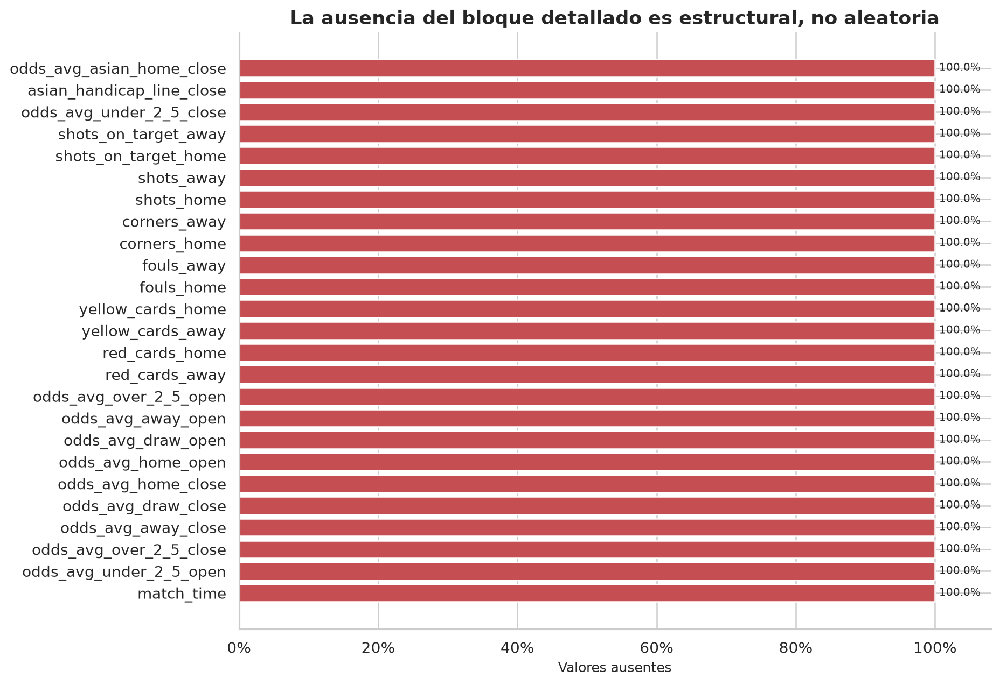

## 4. Distribución y balance del target

La clase H domina, seguida de A y D. El ratio entre clase mayoritaria y minoritaria es **1.85**: existe desbalance moderado, no extremo. Accuracy por sí sola no será suficiente; el protocolo aprobado usa macro-F1 como métrica principal y balanced accuracy como métrica secundaria.

La mezcla de resultados cambia por temporada. La asociación temporada-target es baja (V de Cramér=0.028), pero el orden temporal sigue siendo crítico para evitar evaluar con información futura.

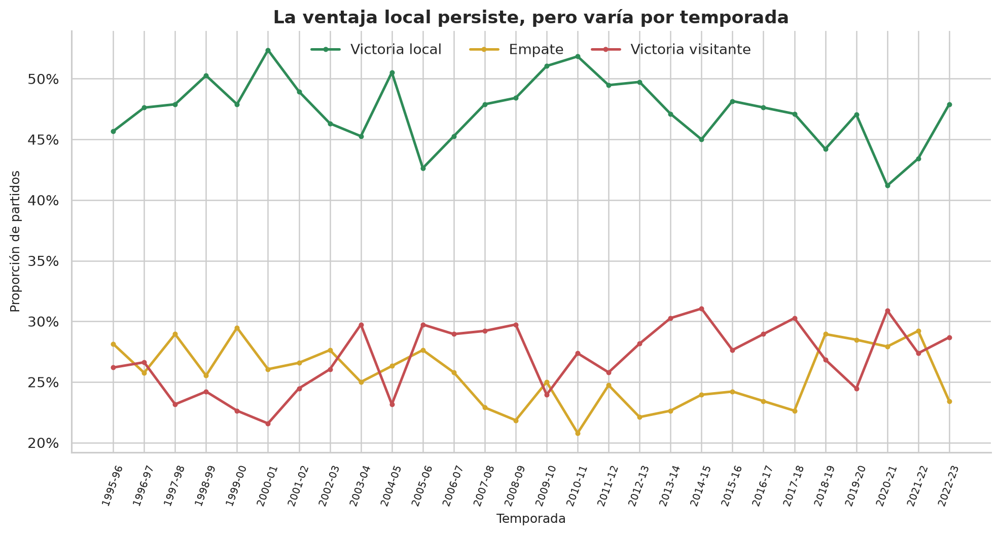

## 5. Distribuciones, evolución temporal y outliers

Los goles son variables discretas con cola derecha. Los valores extremos identificados por IQR representan goleadas reales plausibles y no errores automáticos; deben validarse, no truncarse por defecto.

La tasa de victoria local y la diferencia media de goles fluctúan a lo largo de las temporadas. Esto indica posible cambio temporal de distribución y recomienda particiones cronológicas y features de forma calculadas únicamente con partidos anteriores.

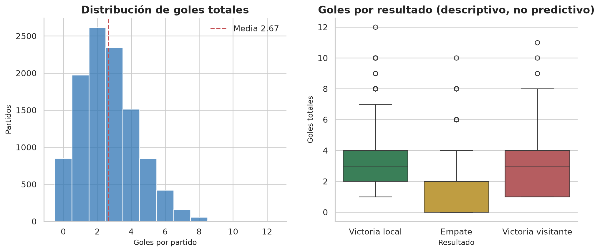

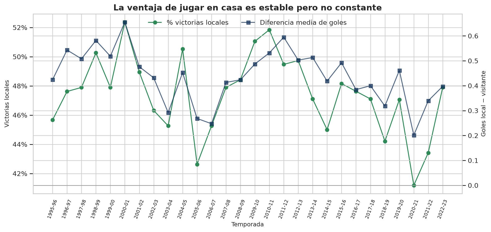

| Variable | Límite inferior IQR | Límite superior IQR | Outliers | Porcentaje |
|---|---:|---:|---:|---:|
| `home_goals_ft` | -0.5 | 3.5 | 891 | 8.2% |
| `away_goals_ft` | -3.0 | 5.0 | 30 | 0.3% |
| `total_goals` | -3.5 | 8.5 | 21 | 0.2% |
| `shots_home` | N/A | N/A | 0 | 0.0% |
| `shots_away` | N/A | N/A | 0 | 0.0% |
| `shots_on_target_home` | N/A | N/A | 0 | 0.0% |
| `shots_on_target_away` | N/A | N/A | 0 | 0.0% |
| `fouls_home` | N/A | N/A | 0 | 0.0% |
| `fouls_away` | N/A | N/A | 0 | 0.0% |
| `yellow_cards_home` | N/A | N/A | 0 | 0.0% |
| `yellow_cards_away` | N/A | N/A | 0 | 0.0% |
| `red_cards_home` | N/A | N/A | 0 | 0.0% |
| `red_cards_away` | N/A | N/A | 0 | 0.0% |

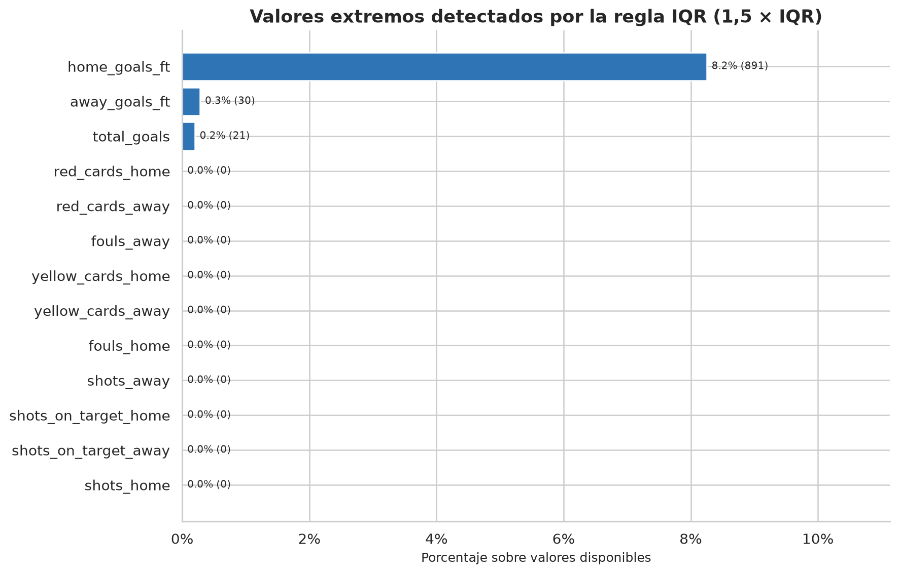

Conclusión: los extremos de goles, tiros y tarjetas son observaciones deportivas plausibles. No se eliminan automáticamente; la limpieza retira errores lógicos, no partidos raros pero válidos.

## 6. Equipos y cardinalidad

Hay 48 equipos distintos en el rol local. `match_id` es único al 100.0% y debe tratarse exclusivamente como identificador. Los nombres de equipo sí pueden aportar señal, pero requieren una estrategia capaz de manejar ascensos, descensos y categorías no vistas. Una alternativa más robusta es derivar forma, Elo o promedios móviles usando solo el pasado.

La asociación bruta del equipo local con el target es V=0.168 y la del visitante V=0.180; no implican causalidad.

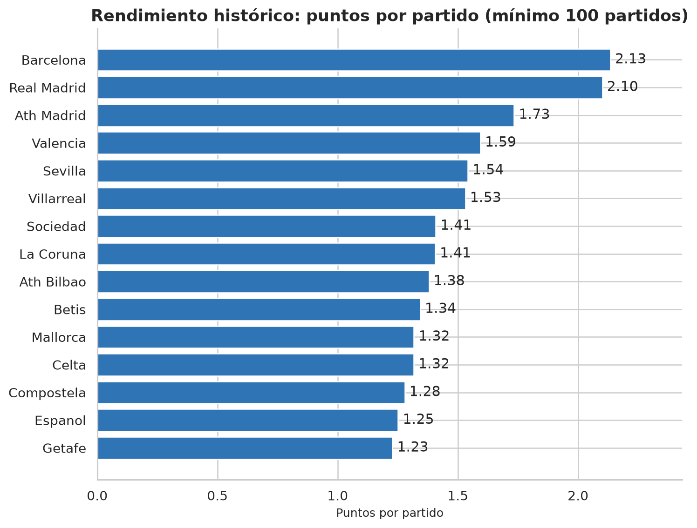

## 7. Relaciones entre variables y target

El bloque con tiros, faltas, tarjetas y cuotas pertenece a 2025-26, una temporada reservada para test. Por tanto, queda fuera de este EDA y no se extraen conclusiones sobre su relación con el target.

No se evalúa señal de cuotas en este EDA porque las observaciones disponibles pertenecen al test protegido.

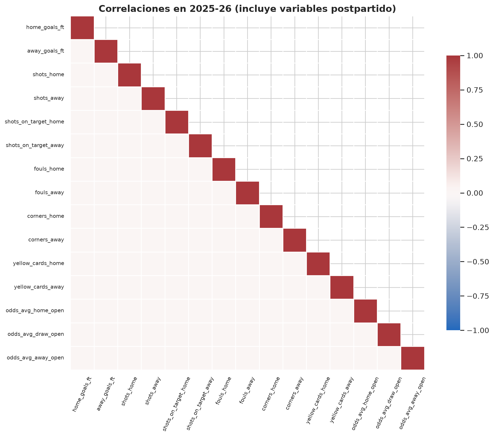

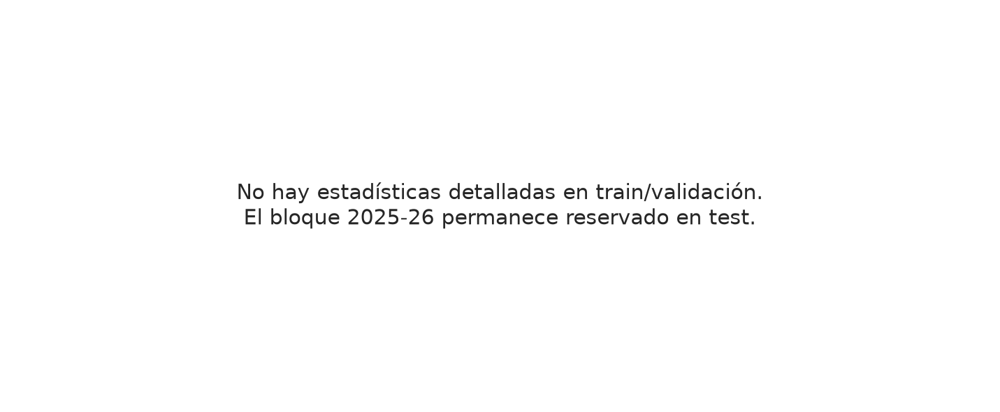

## 8. Matrices de confusión descriptivas

Los splits ya están congelados, pero todavía no se entrena ningún candidato porque el gate `Data Ready` sigue abierto. Se incluyen dos reglas de referencia:

1. **Clase mayoritaria** sobre el conjunto de desarrollo (train + validation): siempre predice H y alcanza 47.4%. Evidencia que accuracy puede ocultar un fallo total en D y A.

| Real \ Predicha | H | D | A |
|---|---:|---:|---:|
| H | 5119 | 0 | 0 |
| D | 2761 | 0 | 0 |
| A | 2924 | 0 | 0 |

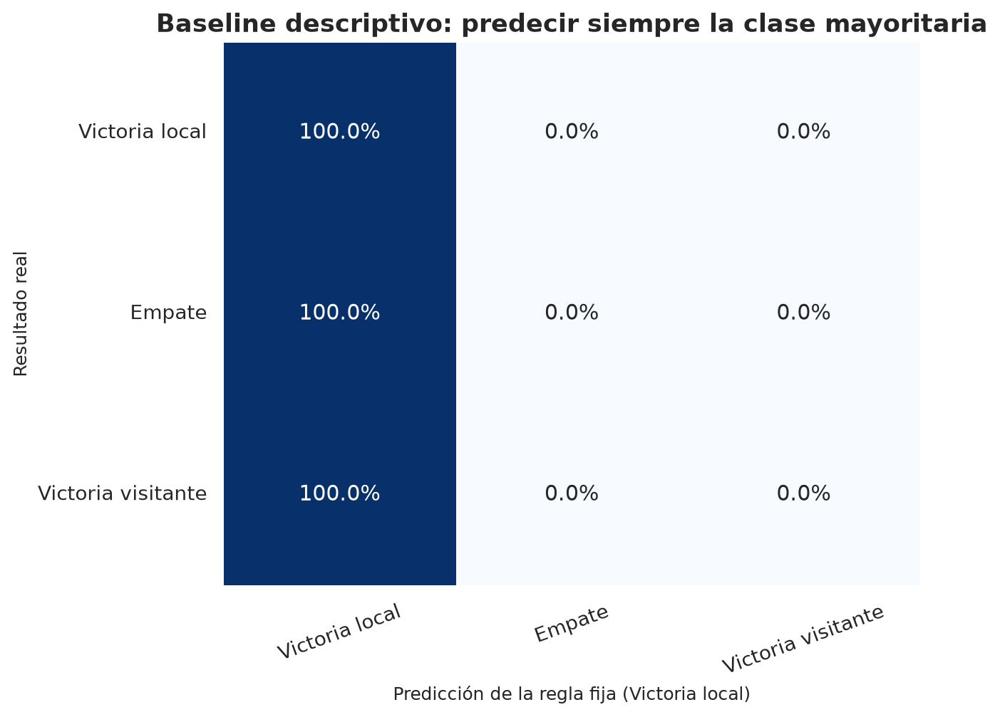

2. **Favorito de cuotas de apertura**: no disponible en el conjunto de desarrollo; la matriz se conserva vacía para documentar esa ausencia.

| Real \ Favorito | H | D | A |
|---|---:|---:|---:|
| H | 0 | 0 | 0 |
| D | 0 | 0 | 0 |
| A | 0 | 0 | 0 |

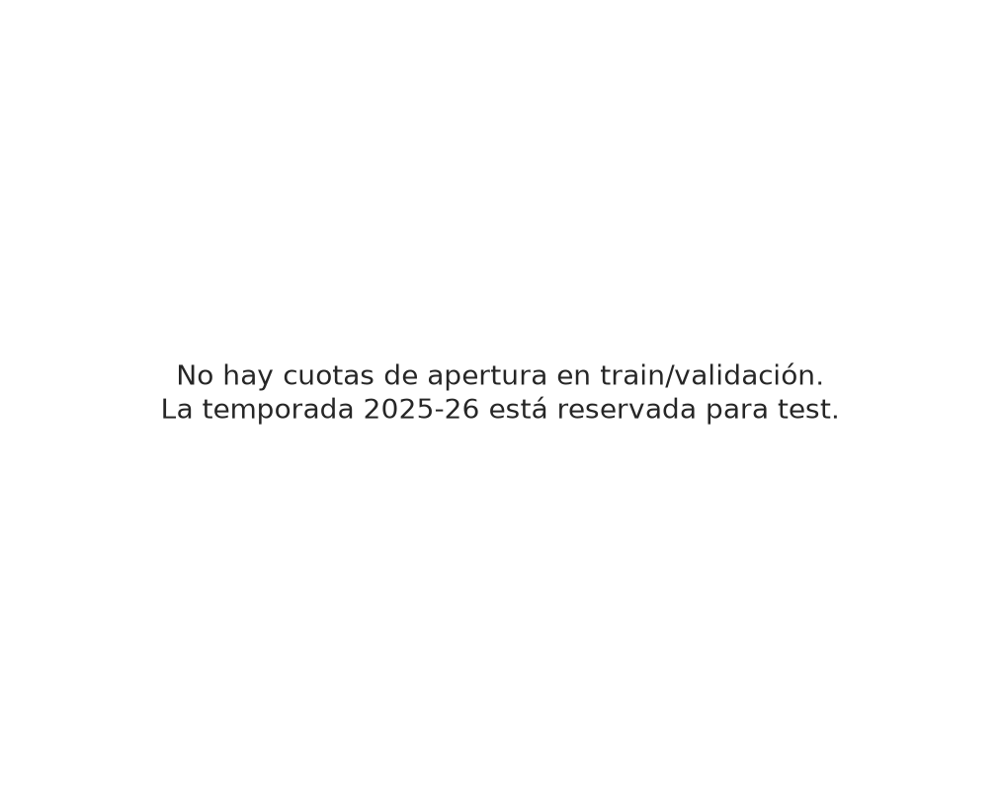

## 9. Riesgo de leakage

Se deben excluir del entrenamiento prepartido del mismo encuentro:

- Marcador final y al descanso, resultado al descanso y todas sus derivadas.
- Tiros, tiros a puerta, faltas, córners y tarjetas.
- `total_goals`, diferencias, clean sheets, puntos, over 2,5 y ambos marcan.
- Metadatos de fuente/cobertura, que revelan la temporada y el mecanismo de captura.
- `match_id`, que no tiene valor predictivo generalizable.

La fecha, temporada y equipos son inputs disponibles, pero no deben transformarse usando datos futuros. Las cuotas de cierre quedan condicionadas a definir la ventana de inferencia.

## 10. Viabilidad para una aplicación

Inputs directamente solicitables: equipo local, visitante, fecha/hora y, si existe una integración externa aprobada, cuotas prepartido. Para ofrecer valor sin depender de casas de apuestas, el pipeline debería generar forma reciente, fuerza ofensiva/defensiva y rating histórico a partir de partidos anteriores.

No son inputs aceptables: goles, tiros, tarjetas o cualquier estadística ocurrida durante/después del partido que se intenta predecir.

## 11. Reglas comunes propuestas

1. Mantener ambos CSV raw inmutables y verificar sus SHA-256.
2. Deduplicar por fecha + local + visitante y priorizar la fila detallada.
3. Normalizar fechas, temporada y tipos con el loader común.
4. No imputar el bloque detallado sobre 1995-96–2024-25: es ausencia estructural.
5. Excluir leakage y metadatos antes de modelar.
6. Construir features históricas con `shift`/ventanas cerradas al pasado.
7. Usar el split temporal aprobado y congelado en T-1.5.
8. Proteger el test final y ajustar transformaciones solo con train.

## 12. Limitaciones y decisiones pendientes

- Las URL y la trazabilidad están documentadas; la redistribución pública no está demostrada y requiere permiso explícito o retirada de los datos versionados.
- El target, el usuario, la ventana de predicción y el protocolo de evaluación están aprobados.
- El bloque detallado representa una única temporada y no permite asumir estabilidad histórica.
- Las primeras temporadas contienen más partidos por cambios de tamaño de la liga; comparar conteos brutos sin normalizar puede inducir a error.
- Las matrices mostradas son reglas descriptivas sobre desarrollo; existen splits congelados, pero todavía no se han entrenado candidatos.

## Reproducibilidad

```powershell
python -m venv .venv
.\.venv\Scripts\python.exe -m pip install -r requirements-eda.txt
.\.venv\Scripts\python.exe scripts\run_laliga_preprocessing.py
.\.venv\Scripts\python.exe scripts\run_laliga_eda.py
.\.venv\Scripts\python.exe scripts\create_preprocessing_notebook.py
.\.venv\Scripts\python.exe scripts\create_eda_notebook.py
.\.venv\Scripts\python.exe scripts\execute_eda_notebook.py
.\.venv\Scripts\python.exe -m pytest
```

Los artefactos métricos se guardan en `reports/metrics/`, las figuras en `reports/figures/` y el dataset limpio versionable en `data/processed/laliga_matches_clean.csv`.
